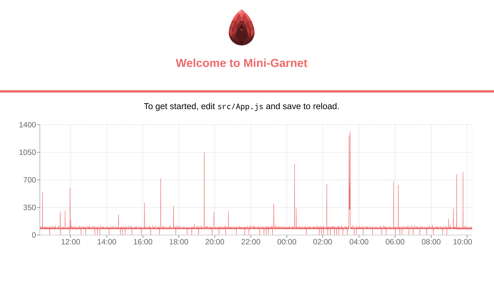

# Sample Garnet App

This app mimicks garnet's basic functionality, fetches data from infoset-ng and displays it on a graph.

Disclaimer: CORS needs to be disabled for graph to work
See instructions for 
- Firefox : https://stackoverflow.com/questions/17088609/disable-firefox-same-origin-policy#29096229
- Chrome : https://chrome.google.com/webstore/detail/allow-control-allow-origi/nlfbmbojpeacfghkpbjhddihlkkiljbi

## Install

```bash
λ git clone https://github.com/PalisadoesFoundation/sample-garnet-app.git
λ cd sample-garnet-app
λ npm install
λ npm start
```

## Challenge

Mini-Garnet is supposed to show me one pretty red graph but I can't seem to get it to work. Solve these errors for me

Bonus point if you add a second graph ;).

## Solution

This is what mini-garnet should look like when it works

